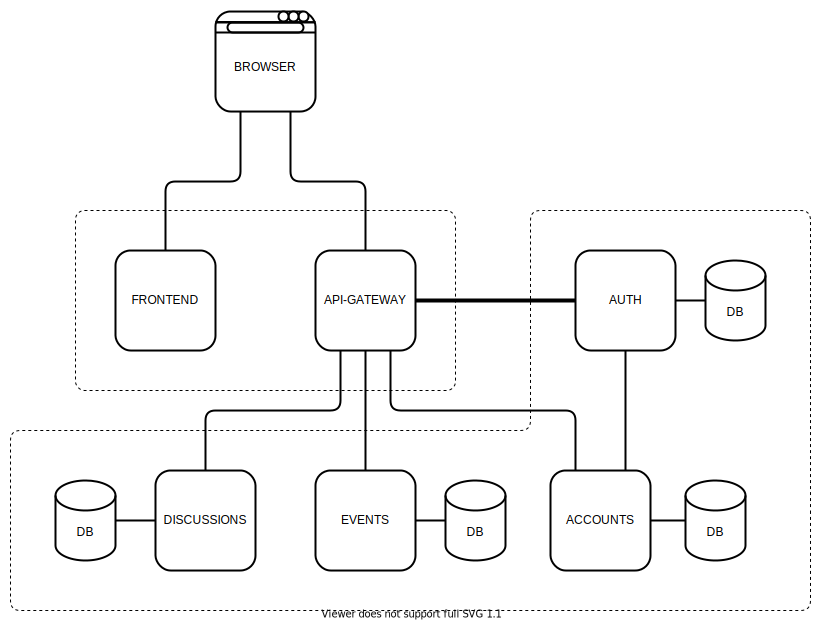

# Service info

Description of all backend micro-services and frontend

## Table of content

- [General System Info](#General-System-Info)
- [Setup](#Setup)
    -   [Database Setup](#Database-Setup)
    -   [Backend Installing](#Backend-Installing)
    -   [Backend Running](#Backend-Running)
    -   [Frontend Installing and Running](#Frontend-Installing-and-Running)

## General System Info

### System Architecture

### Frontend:
-   Vue 3
-   Bootstrap 5

### Backend (full async):
-   Python3 + FastAPI + uvicorn
-   PostgreSQL + SQLAlchemy
-   httpx
-   passlib + bcrypt and python-jose
-   pyyaml

## Setup

### Database Setup

For each micro-service except API-Gateway:

1.  Install PostgeSQL (Ubuntu):

            sudo apt install -y postgresql

2.  Log to postgres:

            sudo su - postgres

3.  Create new db {role/user} with password:

            createuser {username} --pwprompt

4.  Create {DB}:

            createdb -O {username} {dbname}

5.  Connect to created {db}:

            psql {dbname}

6.  Grant accesses:

            GRANT ALL ON DATABASE {dbname} to {username};

### Backend Installing

For each micro-service:

1.  Install Python3 packages (Ubuntu):
        
            sudo apt install git python3 python3-pip

2.  Clone repo and go to dir:

            git clone git@github.com:CoEvDi/{backend-micro-service}.git
            cd {backend-micro-service}
    
3.  Install and/or update (-U) project dependencies:

            pip3 install -U -r requirements.txt

### Backend Running

1.  Each backend microservice dynamically takes its settings through YAML config, so copy and rename `config.yaml.template` to `config.yaml` and fill your data

2.  Start with `python3 main.py` or `nohup python3 main.py > backend.log &` (if needs to start in background with logs to backend.log)

3. Use these run parameters (also available via `python3 main.py --help`):
    -   `-H`/`--Host` - backend host [REQUIRED]
    -   `-P`/`--Port` - backend port [REQUIRED]
    -   `-CT`/`--Create-Tables` - (Re)Creating database tables before launch [REQUIRED AT FIRST STARTUP]

### Frontend Installing and Running